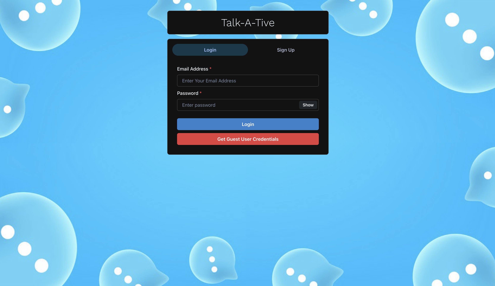
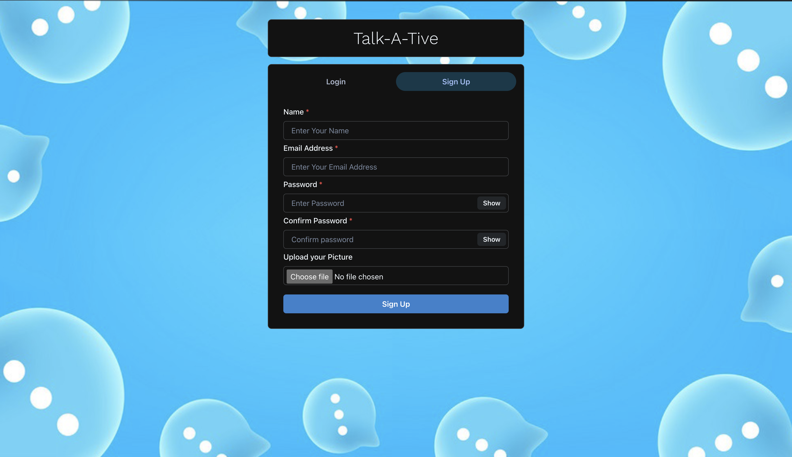
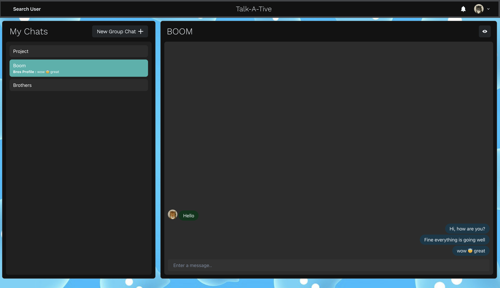
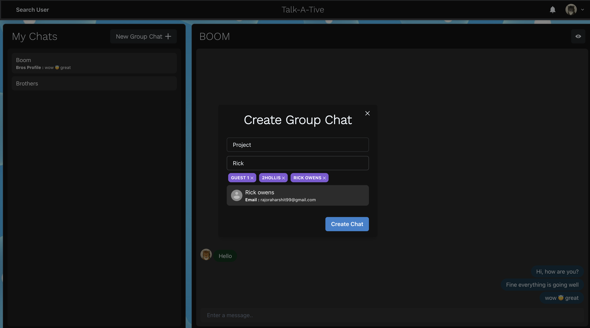
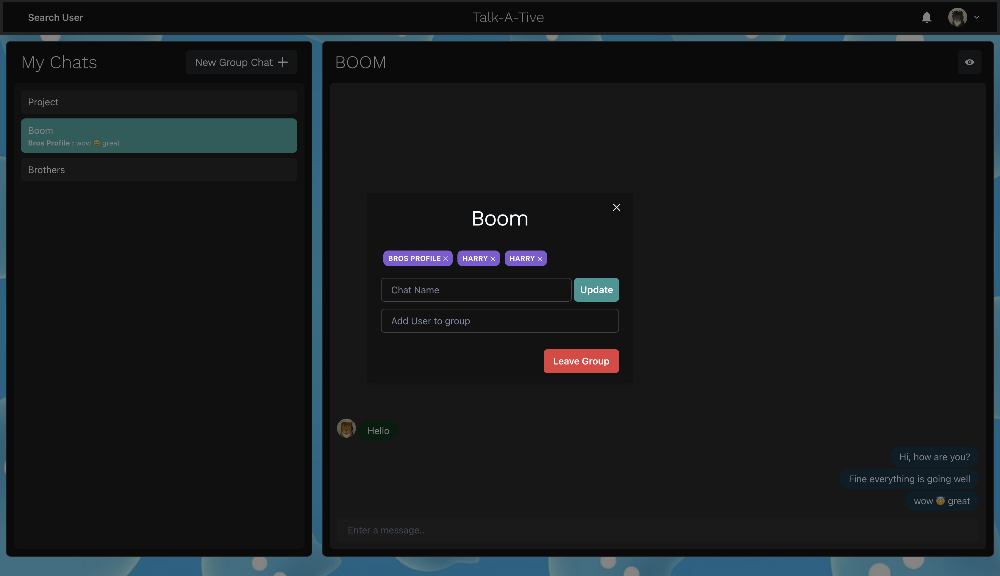

# Talk-A-Tive

This project is made as a learning project.
Talk-a-tive is a Full Stack Real Time Chatting App.
It uses Socket.io for real time communication and stores user details in encrypted format in Mongo DB Database.
## Tech Stack

**Client:** React JS

**Server:** Node JS, Express JS

**Database:** Mongo DB
  

## Run Locally

Clone the project

```bash
  git clone https://github.com/harshitrajora/Chat-app.git
```

Go to the project directory

```bash
  cd Chat-app
```

Install dependencies

```bash
  npm install
```

```bash
  cd frontend/
  npm install --legacy-peer-deps
```

Start the server

```bash
  npm run start
```
Start the Client

```bash
  //open now terminal
  cd frontend
  npm start
```
  
# Features

### Authenticaton


### Chatting

### Search Users

### Create Group Chats

### Add or Remove users from group

